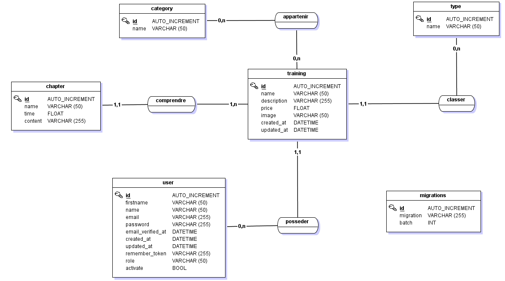

## Définition du projet
Ce projet à pour but de créer une plateforme de formations en ligne. Les visiteurs du site peuvent consulter en libre accès les formations ainsi que leurs détails.
Si un visiteur le souhaite, il peut envoyer un formulaire de contact pour devenir formateur. L'administrateur du site pourra accepter la demande de l'utilisateur via un dashboard. Enfin l'utilisateur enregistré pourra facilement créer des formations composés de chapitre, de catégorie, de type, etc... L'utilisateur peut a tous moment supprimer ou modifier les formations qu'il a mis en ligne.


## Pré-requis

Etapes à suivre pour installer le projet en local : 
- Vérifier la présence de php sur votre système avec la commande ```php --version```.
- Vérifier qu'une version de MySql pouvant accueillir la base de données est présente sur votre système.
- Vérifier qu'une version de composer est installé sur votre système avec la commande ```composer --version```.

## Initialisation

Etape à suivre pour initialiser le projet en local :
- Ouvrir un terminal dans votre dossier projet.
- Exécuté la commande ```composer install``` pour récupérer les dépendances utilisées.
- Si un fichier ".env" ne s'est pas créer automatiquement, copier le fichier ".env.example" (sans oublié de le renommer) puis exécutez la commande suivante : ```php artisan key:generate```.
- Pour rattacher votre service de mail de test, modifier les champs ```MAIL_MAILER=, MAIL_HOST=, MAIL_PORT=, MAIL_USERNAME=, MAIL_PASSWORD=, MAIL_ENCRYPTION=,``` du fichier ".env".
- Création d'une base de donnée au nom suivant : laravel_training.
- N'oubliez pas de mettre le nom de la base de données dans le champs ```DB_DATABASE=``` de votre fichier ".env" ainsi que votre configuration MySql.
- Utilisation de la commande ```php artisan migrate``` pour créer la base de données.
- Exécuté la commande ```php artisan db:seed``` pour remplir la base de données.

## Lancement

- Exécuté la commande ```php artisan serve``` pour démarrer l'application.


## Documentation technique

- MCD : disponible dans le dossier bdd_model au format .png ou .mcd


